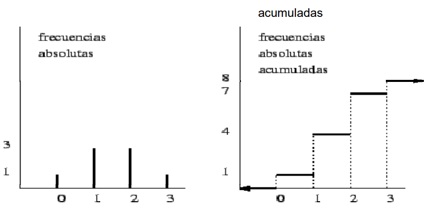

# Introducción a la Matemática Estadística

La estadística es una herramienta esencial en el campo de la bioingeniería, ya que permite analizar y comprender datos biológicos y biomédicos, facilitando la toma de decisiones basadas en evidencia.

## 1. Población

**Definición:** Conjunto total de individuos, objetos o medidas que poseen alguna característica común y que son objeto de estudio.

_Ejemplo:_ Si queremos estudiar la presión arterial de todos los adultos en una ciudad, la población serían todos los adultos de esa ciudad.

## 2. Muestra

**Definición:** Subconjunto seleccionado de la población. Una muestra es representativa si refleja adecuadamente las características de la población de la que se extrajo.

_Ejemplo:_ Si tomamos la presión arterial de 100 adultos seleccionados al azar de la ciudad, esos 100 adultos constituyen una muestra.

## 3. Individuo

**Definición:** Cada uno de los elementos que componen la población o la muestra.

_Ejemplo:_ En el caso de la presión arterial, cada adulto de la ciudad (o de la muestra) es un individuo.

## 4. Variable

**Definición:** Característica o atributo que puede asumir diferentes valores y que es susceptible de ser medida o contada.

- **Variable Cuantitativa:** Aquella que puede medirse y expresarse en números. Puede ser:

  - **Continua:** Puede tomar cualquier valor en un intervalo. _Ejemplo:_ Presión arterial, altura.
  - **Discreta:** Puede tomar valores aislados o puntuales. _Ejemplo:_ Número de hijos, número de células en un campo microscópico.

- **Variable Cualitativa:** Aquella que describe cualidades y no puede medirse en términos numéricos. Puede ser:
  - **Nominal:** No tiene un orden específico. _Ejemplo:_ Tipo de sangre, género.
  - **Ordinal:** Tiene un orden o jerarquía. _Ejemplo:_ Grado de severidad de una enfermedad (leve, moderado, severo).

## 5. Clasificación de Variables

Las variables en bioingeniería pueden clasificarse según su naturaleza y el tipo de información que proporcionan:

### Variables Cualitativas

Toman valores que no se pueden asociar naturalmente a un número.

- **Nominal:** Si toma valores que no se pueden ordenar.

  - Color de cables
  - Religión
  - Estado civil

- **Ordinal:** Si toma valores que se pueden ordenar.
  - Nivel de Educación
  - Grado académico
  - Intensidad de dolor

### Variables Cuantitativas

Toman valores que se pueden asociar naturalmente a un número.

- **Discreta:** Si toma valores enteros.

  - Número de hijos
  - Número de accidentes
  - Cantidad de glóbulos rojos

- **Continua:** Si toma valores enteros y decimales.
  - Consumo de energía eléctrica mensual
  - Tiempo de vida útil de un artefacto eléctrico
  - Altura, Peso

# Distribución de Frecuencias y Gráficos

Tras comprender las bases de la estadística y la clasificación de variables, es esencial aprender cómo representar y resumir grandes conjuntos de datos. Una herramienta fundamental para ello es la distribución de frecuencias y su representación gráfica.

## 1. Distribución de Frecuencias

Una distribución de frecuencias es una tabla que muestra cómo se distribuyen las repeticiones (frecuencias) de cada valor o intervalo de valores en un conjunto de datos.

### Frecuencia Absoluta

**Definición:** Es el número de veces que se repite un determinado valor en un conjunto de datos. Formula: $` f_i `$

_Ejemplo:_ Si en una clase de 30 estudiantes, 10 tienen 20 años, la frecuencia absoluta de estudiantes de 20 años es 10.

### Frecuencia Relativa

**Definición:** Es la proporción o porcentaje que representa una frecuencia absoluta respecto al total de datos. Formula: $` f_i = \frac{f_i}{N} `$

_Ejemplo:_ Siguiendo el ejemplo anterior, la frecuencia relativa de estudiantes de 20 años sería \( \frac{10}{30} = 0.33 \) o 33%.

### Frecuencia Acumulada

**Definición:** Es la suma de las frecuencias absolutas de todos los valores hasta un determinado valor. Formula: $` F_i = \sum_{j=1}^{i} f_j `$

_Ejemplo:_ Si además de los 10 estudiantes de 20 años, hay 5 de 21 años y 15 de 22 años, la frecuencia acumulada para los estudiantes de 22 años sería 10 + 5 + 15 = 30.

### Frecuencia Relativa Acumulada

**Definición:** Es la suma de las frecuencias relativas de todos los valores hasta un determinado valor. Formula: $` F_i = \sum_{j=1}^{i} f_j `$

_Ejemplo:_ Siguiendo el ejemplo anterior, la frecuencia relativa acumulada para los estudiantes de 22 años sería $` \frac{10}{30} + \frac{5}{30} + \frac{15}{30} = 1 `$ o 100%.

## 2. Gráficos

Los gráficos son representaciones visuales que facilitan la comprensión y el análisis de los datos. Dependiendo del tipo de variable y la información que se quiera transmitir, se pueden utilizar diferentes tipos de gráficos.

### Para Variables Cualitativas

- **Diagrama de barras:** Representa la frecuencia de cada categoría mediante barras, siendo la altura proporcional a la frecuencia.
- **Diagrama de pastel o torta:** Representa la proporción de cada categoría en un círculo.

### Para Variables Cuantitativas

- **Histograma:** Similar al diagrama de barras, pero para datos cuantitativos. Las barras representan intervalos de valores.
- **Polígono de frecuencias:** Une con líneas rectas los puntos que representan las frecuencias de cada intervalo.
- **Ojiva:** Representa la frecuencia acumulada.

## 3. Cálculo del Número de Intervalos y Amplitud

Cuando se trabaja con variables cuantitativas continuas, es común agrupar los datos en intervalos para facilitar su representación y análisis. Para ello, es necesario determinar cuántos intervalos usar y cuál será su amplitud.

### Cálculo del Número de Intervalos

Una de las fórmulas más utilizadas para determinar el número de intervalos es la **fórmula de Sturges**:

$` [ k = 1 + 3.322 \times log{10}(n) ] `$

Donde:

- $` k `$ es el número de intervalos.
- $` n `$ es el número total de datos.

### Amplitud de los Intervalos

Una vez determinado el número de intervalos, la amplitud (o ancho) de cada intervalo se calcula como:

$` A = \frac{R}{k} `$

Donde:

- \( A \) es la amplitud de los intervalos.
- \( R \) es el rango de los datos, que se calcula como la diferencia entre el valor máximo y el valor mínimo.
- \( k \) es el número de intervalos.

## 4. La Fórmula de Sturges

La **fórmula de Sturges** es una regla empírica que proporciona una estimación rápida del número de intervalos que se deben usar al construir un histograma para un conjunto de datos. Fue propuesta por Herbert A. Sturges en 1926 y es especialmente útil cuando se tiene un gran conjunto de datos.

La fórmula es:

$` k = 1 + 3.322 \times log{10}(n) `$

Es importante mencionar que, aunque la fórmula de Sturges es ampliamente utilizada, en algunos contextos o con ciertos tipos de datos, puede ser más apropiado usar otro método para determinar el número de intervalos.

# Medidas de Resumen

Las medidas de resumen son estadísticas que proporcionan información sintetizada sobre un conjunto de datos. Estas medidas son esenciales para entender la distribución, tendencia y dispersión de los datos.

## Medidas de Tendencia Central

Las medidas de tendencia central identifican un valor central o típico en un conjunto de datos.

### Media Aritmética

**Definición:** Es la suma de todos los valores en un conjunto de datos dividida por el número total de valores.

$$ \bar{X} = \frac{\sum\_{i=1}^{n} x_i}{N} $$

Donde:

- $` \bar{X} `$ es la media aritmética.
- $` x_i `$ son los valores individuales.
- $` n `$ es el número total de datos.

Si los datos se repiten más de una vez y se presentan en una distribución de frecuencia, la fórmula de la media aritmética se puede expresar como:

$` \bar{X} = \frac{\sum_{i=1}^{k} f_i x_i}{N} `$

Donde:

- $` \bar{X} `$ es la media aritmética.
- $` f_i `$ es la frecuencia absoluta de cada valor.
- $` x_i `$ son los valores individuales.
- $` k `$ es el número de valores diferentes.

Si se trata de datos agrupados en intervalos la media se calcula como:

$` \bar{X} = \frac{\sum_{i=1}^{k} m_i f_i}{N} `$

Donde:

- $` \bar{X} `$ es la media aritmética.
- $` m_i `$ es la marca de clase de cada intervalo (promedio de los límites del intervalo). Se calcula como: $` m_i = \frac{L_i + L_s}{2} `$, donde $` L_i `$ es el límite inferior y $` L_s `$ es el límite superior del intervalo.
- $` f_i `$ es la frecuencia absoluta de cada intervalo.
- $` k `$ es el número de intervalos.

### Mediana

**Definición:** Es el valor que divide un conjunto de datos ordenados en dos partes iguales. Si hay un número impar de datos, la mediana es el valor central. Si hay un número par de datos, la mediana es el promedio de los dos valores centrales.

**Ejemplo:** Si tenemos los siguientes datos: 1, 2, 3, 4, 5, 6, 7, 8, 9, 10, la mediana es 5. Si tenemos los siguientes datos: 1, 2, 3, 4, 5, 6, 7, 8, 9, la mediana es 4.5.

### Modo

**Definición:** Es el valor que aparece con mayor frecuencia en un conjunto de datos. Un conjunto de datos puede tener uno, más de uno o ningún modo.

### Percentiles

**Definición:** Los percentiles dividen un conjunto de datos ordenados en 100 partes iguales. El percentil $ p $ es el valor por debajo del cual se encuentra el $ p $% de los datos.

Por ejemplo:

- El 25º percentil (también conocido como primer cuartil) es el valor por debajo del cual se encuentra el 25% de los datos.
- El 50º percentil (también conocido como mediana) es el valor por debajo del cual se encuentra el 50% de los datos.
- El 75º percentil (también conocido como tercer cuartil) es el valor por debajo del cual se encuentra el 75% de los datos.

### Cuartiles

**Definición:** Los cuartiles dividen un conjunto de datos ordenados en cuatro partes iguales.

- **Primer Cuartil (Q1):** Es el valor que separa el 25% inferior de los datos.
- **Segundo Cuartil (Q2):** Es la mediana y separa el 50% de los datos.
- **Tercer Cuartil (Q3):** Es el valor que separa el 75% inferior de los datos.

El rango intercuartil (RIC) se define como:

$` RIC = Q3 - Q1 `$

Y mide la dispersión de la mitad central de los datos.

# Medidas de Dispersión

Mientras que las medidas de tendencia central nos proporcionan un valor representativo o central de un conjunto de datos, las medidas de dispersión nos indican cuánto se alejan los datos de ese valor central. Estas medidas son esenciales para entender la variabilidad o consistencia de un conjunto de datos.

## 1. Rango

**Definición:** Es la diferencia entre el valor máximo y el valor mínimo de un conjunto de datos.

$` Rango = X_{max} - X_{min} `$

Donde:

- $` X_{max} `$ es el valor máximo.
- $` X_{min} `$ es el valor mínimo.

## 2. Varianza

La varianza mide cuánto varían los datos respecto a la media.

### Para una población:

$` \sigma^2 = \frac{\sum_{i=1}^{N} (x_i - \mu)^2}{N} `$

Donde:

- $` \sigma^2 `$ es la varianza de la población.
- $` x_i `$ son los valores individuales.
- $` \mu `$ es la media de la población.
- $` N `$ es el número total de datos en la población.

### Para una muestra:

$` s^2 = \frac{\sum_{i=1}^{n} (x_i - \bar{x})^2}{n-1} `$

Donde:

- $` s^2 `$ es la varianza de la muestra.
- $` x_i `$ son los valores individuales.
- $` \bar{x} `$ es la media de la muestra.
- $` n `$ es el número total de datos en la muestra.

## 3. Desviación Estándar

**Definición:** Es la raíz cuadrada de la varianza. Mide la dispersión promedio de los datos respecto a la media.

### Para una población:

$` \sigma = \sqrt{\sigma^2} `$

### Para una muestra:

$` s = \sqrt{s^2} `$

## 4. Coeficiente de Variación

**Definición:** Es una medida relativa de dispersión que indica la variabilidad de los datos en relación con la media. Es especialmente útil para comparar la variabilidad entre dos o más conjuntos de datos con diferentes unidades o magnitudes.

$` CV = \left( \frac{s}{\bar{x}} \right) \times 100\% `$

Donde:

- $` CV `$ es el coeficiente de variación.
- $` s `$ es la desviación estándar de la muestra.
- $` \bar{x} `$ es la media de la muestra.

# Otras Medidas

Más allá de las medidas de tendencia central y dispersión, existen otras medidas que nos ayudan a entender la estructura y forma de un conjunto de datos. Estas medidas nos proporcionan información sobre la simetría y la forma de la distribución de los datos.

## 1. Distribución respecto a un Eje de Simetría

La simetría de una distribución se refiere a cómo se distribuyen los datos en relación con su media. Las medidas que nos ayudan a entender la simetría son:

### Coeficiente de Asimetría (Skewness)

**Definición:** Es una medida que indica la dirección y grado de asimetría de una distribución.

$` g_1 = \frac{n}{(n-1)(n-2)} \sum_{i=1}^{n} \left( \frac{x_i - \bar{x}}{s} \right)^3 `$

Donde:

- $` g_1 `$ es el coeficiente de asimetría.
- $` x_i `$ son los valores individuales.
- $` \bar{x} `$ es la media de la muestra.
- $` s `$ es la desviación estándar de la muestra.
- $` n `$ es el número total de datos en la muestra.

Valores:

- $` g_1 > 0 `$: Asimetría positiva (la cola se extiende hacia la derecha).
- $` g_1 = 0 `$: Distribución simétrica.
- $` g_1 < 0 `$: Asimetría negativa (la cola se extiende hacia la izquierda).

## 2. Distribución según la Forma

La forma de una distribución se refiere a la "puntiagudez" o "aplanamiento" de la misma en relación con una distribución normal.

### Curtosis (Kurtosis)

**Definición:** Es una medida que indica el grado de concentración de los valores alrededor de la media.

$` g_2 = \frac{n(n+1)}{(n-1)(n-2)(n-3)} \sum_{i=1}^{n} \left( \frac{x_i - \bar{x}}{s} \right)^4 - \frac{3(n-1)^2}{(n-2)(n-3)} `$

Donde:

- $` g_2 `$ es el coeficiente de curtosis.
- $` x_i `$ son los valores individuales.
- $` \bar{x} `$ es la media de la muestra.
- $` s `$ es la desviación estándar de la muestra.
- $` n `$ es el número total de datos en la muestra.

Valores:

- $` g_2 > 0 `$: Leptocúrtica (distribución más puntiaguda que la normal).
- $` g_2 = 0 `$: Mesocúrtica (distribución normal).
- $` g_2 < 0 `$: Platicúrtica (distribución más aplanada que la normal).

# Gráfico de Caja (Box-Plot)

El gráfico de caja, también conocido como box-plot o diagrama de caja y bigotes, es una herramienta gráfica que permite visualizar la distribución y variabilidad de un conjunto de datos, así como la presencia de valores atípicos. Es especialmente útil para comparar distribuciones entre varios grupos.

## 1. Componentes del Box-Plot

Un box-plot está compuesto por los siguientes elementos:

- **Caja:** Representa el rango intercuartil (RIC), que es la diferencia entre el tercer cuartil (Q3) y el primer cuartil (Q1). La caja contiene la mitad central de los datos.

  - **Borde inferior:** Representa el primer cuartil (Q1).
  - **Borde superior:** Representa el tercer cuartil (Q3).
  - **Línea dentro de la caja:** Representa la mediana (Q2 o segundo cuartil).

- **Bigotes:** Son líneas que se extienden desde los bordes de la caja hasta los valores mínimos y máximos dentro de un rango determinado.

  - **Bigote inferior:** Se extiende desde Q1 hasta el valor mínimo o hasta el valor más cercano dentro de 1.5 \* RIC por debajo de Q1.
  - **Bigote superior:** Se extiende desde Q3 hasta el valor máximo o hasta el valor más cercano dentro de 1.5 \* RIC por encima de Q3.

- **Puntos fuera de los bigotes:** Representan valores atípicos. Son aquellos valores que se encuentran fuera del rango definido por los bigotes.

## 2. Interpretación

- **Posición de la mediana:** Si la mediana está centrada en la caja, la distribución es simétrica. Si está más cerca de Q1 o Q3, indica asimetría.
- **Ancho de la caja:** Un RIC más amplio indica mayor variabilidad en la mitad central de los datos.
- **Longitud de los bigotes:** Indica la variabilidad fuera de la mitad central de los datos.
- **Valores atípicos:** Pueden indicar errores en los datos o variabilidad extrema.

## 3. Ventajas del Box-Plot

- Proporciona una visión rápida de la distribución y variabilidad de los datos.
- Es útil para identificar valores atípicos.
- Permite comparar fácilmente distribuciones entre diferentes grupos.

## 4. Limitaciones

- No muestra la distribución detallada de los datos.
- No es adecuado para conjuntos de datos pequeños.
